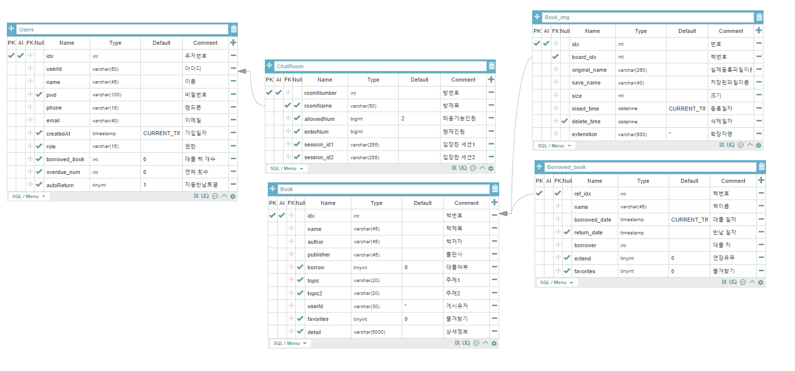
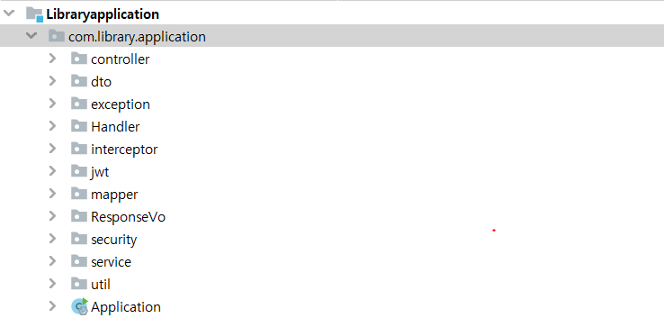
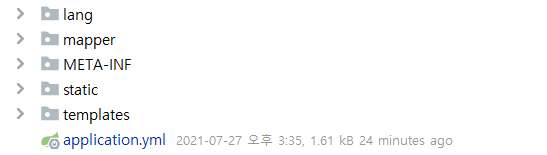
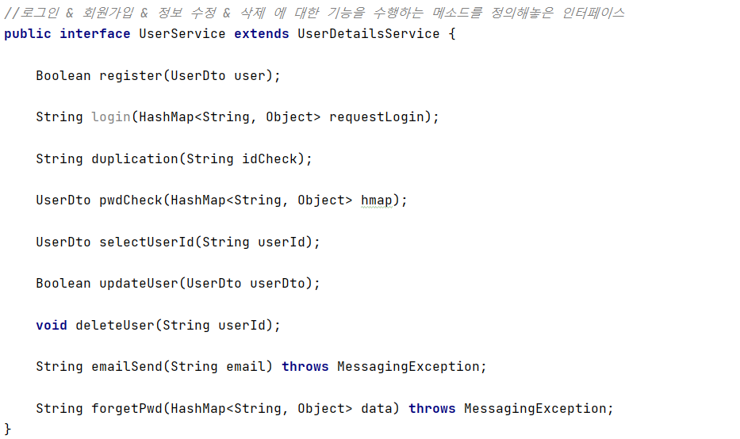
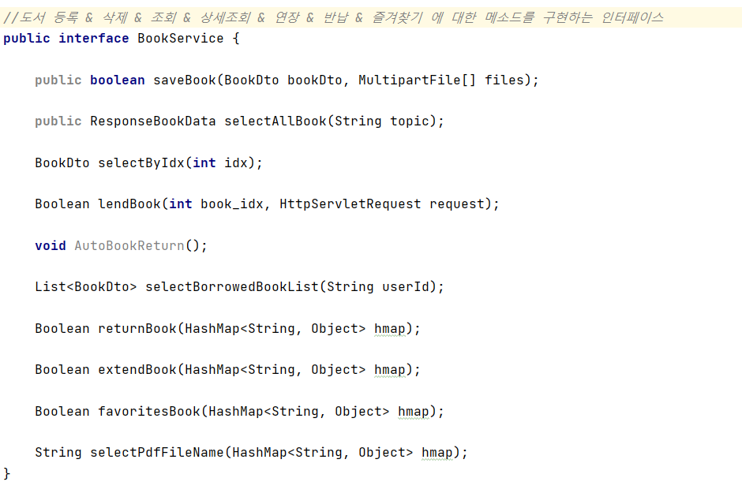
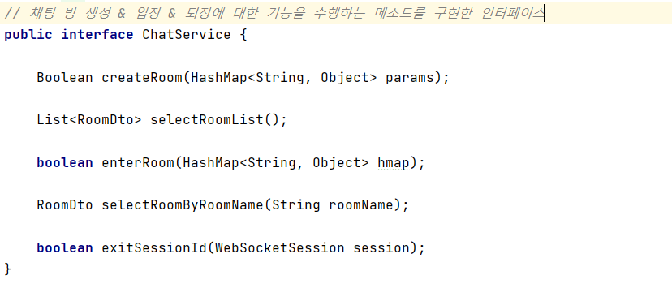
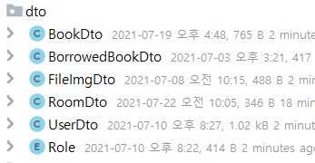
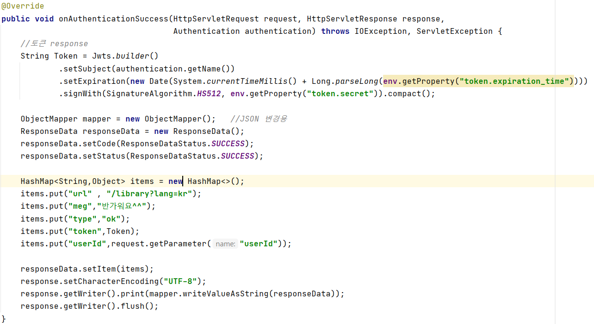
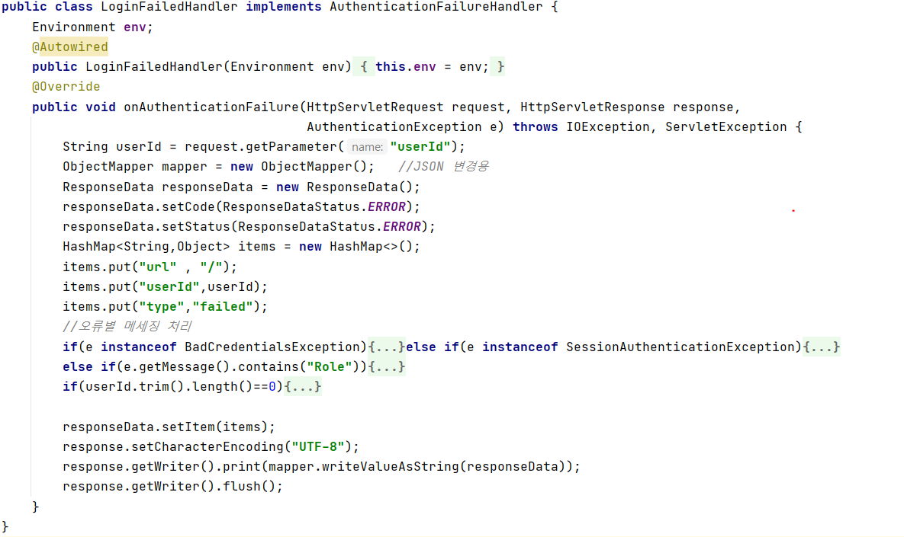
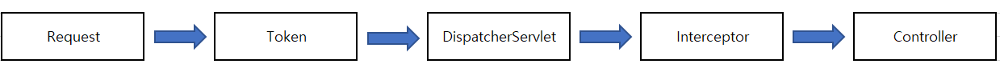

# Library-Project
### 도서관 프로젝트
***
## 목차
- #### [인원구성](#인원구성)
- #### [기간](#기간)
- #### [개요](#개요)
- #### [목표](#목표)
- #### [개발환경](#개발환경)
- #### [ERD](#Server)
- #### [Package](#Package)
- #### [개발내역부록](#개발내역부록)
***
#### 인원구성
- 장진호(개인)
#### 프로젝트 기간
- 21-06-16(수)  ~  2021-07-27(화)
#### 개요
- 객체 지향을 이해하며 Spring Boot 환경설정과 그에맞는 도서관 웹으로서의 기능을<br>
  &nbsp;&nbsp;&nbsp;&nbsp; 추가한다.</li>
- RestFul API 설계방식을 이해하며 요청,응답되는 Resource를 처리한다.
#### 목표
- Spring Boot와 객체지향을 이해하며 ,
  궁극적인 목표는 AWS를 이용한 배포환경을 설계한다.
#### 개발환경
- Tool : IntelliJ IDEA , STS , QueryBox
- Front : HTML , CSS , JS , BootStrap(3.xx) , JQuery
- Template : Thymeleaf
- Back : SpringBoot(2.3.11) , Mybatis , JWT
- DB : MySQL( AWS RDS )
- Server : AWS EC2
#### ERD

***
### Package
#### main

#### Resource

***
### 개발내역부록
- [환경설정](#환경설정)
- [인터셉터,JWT](#인터셉터,JWT)
- [ExceptionHandler](#ExceptionHandler)
- [Security](#Security)
- [jwt](#JWT)
- [Email](#Email)
- [Upload](#Upload)
- [SocketChating](#SocketChating)
- [AWS EC2](#EC2)
- [mybatis](#mybatis)
- [배포URL](#URL)
***
### ✨환경설정 
:one:[Application.yml](#cd-yml)

:two:[Controller](#cd-controller)

:three: [Service](#cd-service)

:four: [dto](#cd-dto)

---
### :cd: yml
- DB
<pre>
datasource:
    driver-class-name:
      com.mysql.cj.jdbc.Driver
    url:
      jdbc:mysql://gyguswlsgh.ciiiy3dtxwx4.ap-northeast-2.rds.amazonaws.com:1521/HyoHyunJinHo?useUnicode=true&characterEncoding=utf8&allowMultiQueries=true
    username:
      gyguswlsgh
    password:
      gyguswlsgh
</pre>
- Google Email Send
<pre>
  mail:
    host: smtp.gmail.com
    port: 587
    username: ses1238@gmail.com
    password: tdrrqd99
    properties:
      mail.smtp.auth: true
      mail.smtp.starttls.enable: true
</pre>
- Mybatis
<pre>
mybatis:
  type-aliases-package: com/library/application/ResponseVo/**
  mapper-locations: mapper/**.xml
</pre>
- JWT Token Config
<pre>
token:
  expiration_time: 864000000 #10 days
  secret: user_login
</pre>
- (Resource)Linux/window 10 & location URL
<pre>
#Linux & window  path
custom:
  path:
    upload-imges: 'D:/library/'
    upload-pdf: 'D:/pdf/'
  Linux:
    upload-imges: 'home/ec2-user/Library-Data/img'
    upload-pdf: 'home/ec2-user/Library-Data/pdf'
#URL location
  location:
    bookSave: /library/booksave
    bookReturn: /library/bookreturn
    userInfo: /user-service/user/info
    userDelete: /user-service/user/
    autoReturn: /user-service/user/auto_return
    bookSelect: /pdfview?file=
</pre>
---
### :cd: Controller

- [StartController](https://github.com/ses9892/Libraryapplication/blob/master/src/main/java/com/library/application/controller/StartController.java)
  - 로그인  & 회원기입 페이지 이동 로그인완료후 요청 URL 대한 컨트롤러
- [StartRestController](https://github.com/ses9892/Libraryapplication/blob/master/src/main/java/com/library/application/controller/StartRestController.java)
  - 회원가입 요청 & 중복체크 & 이메일인증 & 비밀번호찾기 요청에 대한 RestController
  
- [LibraryController](https://github.com/ses9892/Libraryapplication/blob/master/src/main/java/com/library/application/controller/LibraryController.java)
  - 도서관 서비스 이용에 대한 컨트롤러
  
- [UserServiceController](https://github.com/ses9892/Libraryapplication/blob/master/src/main/java/com/library/application/controller/UserServiceController.java)
  - User에 맞는 기능을 제공하는 요청을 받는 컨트롤러
  
- [ChatController](https://github.com/ses9892/Libraryapplication/blob/master/src/main/java/com/library/application/controller/ChatController.java)
  - 채팅 서비스에 요청을 받는 컨트롤러
---
### :cd: Service
- InterFace : UserService 
  - implement : [UserServiceImpl](https://github.com/ses9892/Libraryapplication/blob/master/src/main/java/com/library/application/service/UserServiceImpl.java)
  
- InterFace : BookService 
  - implement : [BookServiceImpl](https://github.com/ses9892/Libraryapplication/blob/master/src/main/java/com/library/application/service/bookservice/BookServiceImpl.java)
  
- InterFace : ChatService 
  - implement : [ChatServiceImpl](https://github.com/ses9892/Libraryapplication/blob/master/src/main/java/com/library/application/service/chatservice/ChatServiceImpl.java)
  
- Class : [MailService](https://github.com/ses9892/Libraryapplication/blob/master/src/main/java/com/library/application/service/MailService.java)
  <pre>
    //메일 인증에 관한 서비스
    @Service
    public class MailService {

      @Autowired
      public JavaMailSender javaMailSender;
  
      @Async
      public void sendMail(String email,String subject, String message) throws MessagingException {
          MimeMessage mimeMessage = javaMailSender.createMimeMessage();
          MimeMessageHelper helper = new MimeMessageHelper(mimeMessage,"utf-8");
  
          helper.setFrom("Library-Service");
          helper.setTo(email); //받는사람
          helper.setSubject(subject);
          helper.setText(message,true);
  
          javaMailSender.send(mimeMessage);
  
      }
  }
  </pre>
---
### :cd: dto
#### [DTO(Data Transfer Object)](https://github.com/ses9892/Libraryapplication/tree/master/src/main/java/com/library/application/dto) 는 계층간 데이터 교환을 위한 자바빈즈

- ROLE (유저별 권한을 지정하기위한 enum class)
<pre>
  @Getter
  @RequiredArgsConstructor
  public enum Role {
      //스프링 시큐리티에서 권한에 사용되는 클래스 , 무조건 ROLE을 붙여야함
  
      GUEST("ROLE_ADMIN", "운영자"),
      USER("ROLE_USER", "일반 사용자");
  
      public final String key;
      public final String title;
  }
</pre>
***
### ✨인터셉터,JWT
- ####[인터셉터 바로가기](https://github.com/ses9892/Libraryapplication/blob/master/src/main/java/com/library/application/interceptor/WebMvcConfig.java)
- ####[Resource 경로 (os별)](#cd-Resource-Handler)
- ####[파일업로드 인코딩 및 크기제한 설정](#cd-FileUpload)
- ####[URL 요청별 JWT 토큰 처리](#cd-JWT)
***
### :cd: Resource-Handler
- 윈도우 & 리눅스 를 나누어 리소스들을 읽어올 경로를 설정
<pre>
//WebMvcConfig.class
// Window10 & Linux Resource Handle
@Override
    public void addResourceHandlers(ResourceHandlerRegistry registry) {
        String os = System.getProperty("os.name").toLowerCase();
        if(os.equals("windows 10")){
        registry
                .addResourceHandler("/img/**")
                .addResourceLocations("file:/"+uploadImgesPath);
        registry
                .addResourceHandler("/pdf/**")
                .addResourceLocations("file:/"+uploadPdfPath);
        registry
                .addResourceHandler("/resource/**")
                .addResourceLocations("/img/**");
        // img/filename , pdf/pdfFileName
        }else{ LinuxChange(registry); }
    }
</pre>
***
### :cd: FileUpload
- 인터셉터 클래스에 CommonsMultipartResolver Bean을 등록하여 
  MultipartResolver 의 파일설정
<pre>
//WebMvcConfig.class
@Bean
public CommonsMultipartResolver multipartResolver() {
    CommonsMultipartResolver multipartResolver = new CommonsMultipartResolver();
    multipartResolver.setDefaultEncoding("UTF-8"); // 파일 인코딩 설정
    multipartResolver.setMaxUploadSizePerFile(5 * 1024 * 1024*100); // 파일당 업로드 크기 제한 (5MB)
    return multipartResolver;
}
</pre>
***

### :cd: JWT
- 요청할 URL에서 Header로 넘어온 JWT 토큰의 유효성검사를 요청하는 경로 설정
- bearerAuthInterceptor 클래스의 preHandle() 에서 토큰의 유효성을 검사 한다.

[userAction.js → pwdCheck()](https://github.com/ses9892/Libraryapplication/blob/master/src/main/resources/static/js/userAction.js)
<pre>
pwdCheck : function (){
        var pwd= $('#user-password').val();
        $.ajax({
            type: "GET",
            url: "/user-service/pwdCheck",
            headers:{
                'content-type':'application/json',
                'Authorization':'bearer'+localStorage.getItem('jwt')
            }
</pre>
<pre>
//WebMvcConfig.class
   @Override
    public void addInterceptors(InterceptorRegistry registry) {
        registry.addInterceptor(bearerAuthInterceptor).addPathPatterns("/check/book")
        .addPathPatterns("/user-service/pwdCheck")
        ...;
    }
</pre>
<pre>
@Override
public boolean preHandle(HttpServletRequest request, HttpServletResponse response, Object handler) throws Exception {
    // HandlerInterceptor의 메소드이며, 인터셉터로 해당 메소드의 재정의한 기능이 수행된다.
    log.info("preHandle Start ( JWT Token Valid)");
    String lang = request.getParameter("lang");
    String Token = null;
    if(request.getParameter("key")!=null){
        Token = request.getParameter("key");
    }else{
        Token = request.getHeader("Authorization");
    }
    String flag = request.getHeader("flag");
    Token = Token.replace("bearer","");
    if(!jwtTokenProvider.validateToken(Token) || Token==null){
         throw new IllegalAccessException("로그인 상태가 유효 하지 않습니다.");
    }
    String userId = jwtTokenProvider.getSubject(Token);     //토큰에담긴 subject = userId
    request.setAttribute("userId",userId);

    return true;
}
</pre>
***
###✨ Security
- ####[Login / Logout Handling](#Login/Logout Handling)
- ####[RememberMe](#RememberMe)
- ####[ROLE](#ROLE)
***
### :cd: Login/Logout Handling
- LoginSuccessHandler , LoginFailedHandler 
- LogoutSuccessHandler 핸들링 처리

### [Spring Security Config](https://github.com/ses9892/Libraryapplication/blob/master/src/main/java/com/library/application/security/securityConfig.java)
<pre>
@Override
protected void configure(HttpSecurity http) throws Exception {
            ...
                .formLogin()
                    .loginPage("/")
                    .loginProcessingUrl("/login")
                    .usernameParameter("userId")
                    .passwordParameter("password")
                    .successHandler(new LoginSuccessHandler(env))
                    .failureHandler(new LoginFailedHandler(env))
                    .permitAll()
                    .and()
                .logout()
                    .logoutUrl("/logout")
                    .deleteCookies("JSESSIONID","remember-me")
                    .invalidateHttpSession(true)
                    .logoutSuccessHandler(new LogoutSuccessHandler() {
                        @Override
                        public void onLogoutSuccess(HttpServletRequest request, HttpServletResponse response, Authentication authentication) throws IOException, ServletException {
                            response.setStatus(HttpServletResponse.SC_OK);
                            response.sendRedirect("/");
                            log.info("로그아웃성공!");
                        }
                    });
</pre>

### Login Success Handler
- 로그인 성공시 JWT 토큰을 발급하며 HashMap items Response


### Login Failed Handler
- 에러타입으로 로그인실패의 메세지와 에러 코드를 Response


### :cd: RememberMe
- Spring Security의 Remember Me를 이용하여 인터넷창 종료시 쿠키를 발급하여
  암호화된 쿠키로 자동로그인이 됩니다.
```
<input name="remember"  id="remember-id" type="hidden" value="remember" checked="checked">
```
```
@Override
protected void configure(HttpSecurity http) throws Exception {
  ...
  ...
  http.rememberMe().tokenValiditySeconds(86400)
                      .rememberMeParameter("rememberMe")
                      .alwaysRemember(true)
                      .userDetailsService(userService);//초단위
}
```

### :cd: ROLE
- Login 시 UserDetail에 등록된 authorities를 비교하여 권한 등급에 따라 요청가능한 페이지가 달라집니다.
- 권한에 맞지 않을경우 403에러 또는 권한이 없을경우 Login페이지로 돌아게됩니다.

```
 @Override
    protected void configure(HttpSecurity http) throws Exception {
    // 권한 처리  권한X -> loginPage Redirect
        http.authorizeRequests().antMatchers("/test","/","/register","/duplication","/email","/forgetPwd").permitAll()
                .antMatchers("/admin-service/**","/chat/room").hasRole("ADMIN")
                .anyRequest().authenticated() 
                .and()
                    .formLogin()
                        .loginPage("/")
                        .loginProcessingUrl("/login")
                        ...
```
#### UserDetails loadUserByUsername()
- Login 후 Request된 Parameter에서 DB와 비교후 UserDetails 하위 클래스인
  User 객체로 리턴해 줌으로써 Login 요청을 하게된 ID,PW,ID의권한이 세션에 저장된다.
```
  @Override
  public UserDetails loadUserByUsername(String s) throws UsernameNotFoundException {
      HashMap<String,Object> hmap = new HashMap<>();
      hmap.put("userId",s);
      UserDto dto = userMapper.findByUserId(hmap);
      if(dto==null){
          throw new UsernameNotFoundException("해당 아이디는 존재하지 않습니다.");
      }
      List<GrantedAuthority> authorities = new ArrayList<>();
      authorities.add(new SimpleGrantedAuthority(dto.getRole()));
      return new User(dto.getUserId(),dto.getPwd(),authorities);
      //리턴된 데이터(유저)는 SecurityContext 의 Authentication에 등록되어 인증정보를 갖춘다.
  }
```
- 비 로그인 메인홈페이지 접속시도

***
### ✨ JWT

- 특정 URL 요청시 Login 이후 SessionStorage 에 등록된 Token을 헤더값에 넣고 요청하며 바로 컨트롤러로 가지않고 인터셉터를 거쳐 Token inVaild 검사를 실행하며 ```
Return true;```일경우 컨트롤러로 요청을 보낸다.
- #### application.yml
```token:
  expiration_time: 864000000 #10 days
  secret: user_login
  ```
- #### TokenVaild
```
public class JwtTokenProvider {
    private String secretKey;   //Token 키 내용
    private long validityInMilliseconds;    //Token의 유지시간

    //@Value() = 매개변수에사용되며 해당매개변수는 JwtTokenProvider의 생성자가 실행될때
    //application.yml 환경설정파일의 적어둔 내용을 읽어서 매개변수에 저장한다.
    public JwtTokenProvider(@Value("${token.secret}") String secretKey, @Value("${token.expiration_time}") long validityInMilliseconds) {
        this.secretKey = secretKey;
        this.validityInMilliseconds = validityInMilliseconds;
    }
    ...
    ...
    //유효한 토큰인지 확인
    public boolean validateToken(String token) {
        try {
            Jws<Claims> claims = Jwts.parser().setSigningKey(secretKey).parseClaimsJws(token);
            String subject = this.getSubject(token);
            if (claims.getBody().getSubject()==null || claims.getBody().getSubject().isEmpty()) {
                return false;
            }
            return true;
        } catch (JwtException | IllegalArgumentException e) {
            return false;
        }
    }
```
- #### BearerAuthInterceptor.java
```
@Override
    public boolean preHandle(HttpServletRequest request, HttpServletResponse response, Object handler) throws Exception {
        // HandlerInterceptor의 메소드이며, 인터셉터로 해당 메소드의 재정의한 기능이 수행된다.
        log.info("preHandle Start ( JWT Token Valid)");
        String lang = request.getParameter("lang");
        String Token = null;
        if(request.getParameter("key")!=null){
            Token = request.getParameter("key");
        }else{
            Token = request.getHeader("Authorization");
        }
        String flag = request.getHeader("flag");
        Token = Token.replace("bearer","");
        if(!jwtTokenProvider.validateToken(Token) || Token==null){
             throw new IllegalAccessException("로그인 상태가 유효 하지 않습니다.");
        }
        String userId = jwtTokenProvider.getSubject(Token);     //토큰에담긴 subject = userId
        request.setAttribute("userId",userId);

        return true;
    }
```
- #### 토큰을 전달하지 않을경우

***
### ✨ Email
- #### Spring Boot mail 사용
```
<dependency>
  <groupId>org.springframework.boot</groupId>
  <artifactId>spring-boot-starter-mail</artifactId>
</dependency>
```
- #### application.yml
  - smtp 환경설정
```
spring:
  mail:
    host: smtp.gmail.com
    port: 587
    username: ###
    password: ###
    properties:
      mail.smtp.auth: true
      mail.smtp.starttls.enable: true
```
- #### MailSender 역할을 수행할 [MailService](https://github.com/ses9892/Libraryapplication/blob/master/src/main/java/com/library/application/service/MailService.java)
```
@Service
public class MailService {

    @Autowired
    public JavaMailSender javaMailSender;

    //동기
    @Async
    public void sendMail(String email,String subject, String message) throws MessagingException {
        MimeMessage mimeMessage = javaMailSender.createMimeMessage();
        MimeMessageHelper helper = new MimeMessageHelper(mimeMessage,"utf-8");

        helper.setFrom("Library-Service");
        helper.setTo(email); //받는사람
        helper.setSubject(subject);
        helper.setText(message,true);
        //HTML 코드를 작성하여 메일을 보낸다.
        javaMailSender.send(mimeMessage);

    }
}
```
***
### ✨ Upload

***
### ✨ SocketChating

***


  


